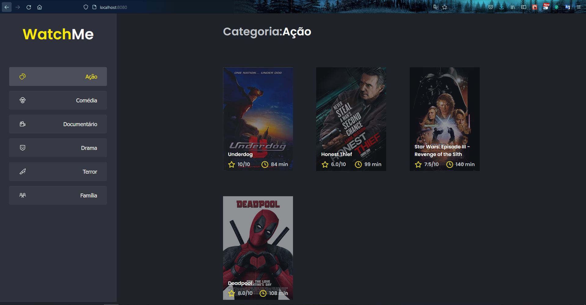

<h1 align="center">Ignite: Desafio 08 - Otimizando a aplicação</h1>

## :bookmark_tabs: Desafio
Nesse desafio deve performar a aplicação React utilizando das ferramentas e dicas aprendidas durante o módulo **Performando apps com ReactJS**. O template utilizado foi o mesmo do [Desafio 2](https://github.com/loressl/desafio-2-trilha-reactjs) e para melhorar a performance foi utilizado:
  
  - memo
  - useCallback

## :sparkler: Aplicação

